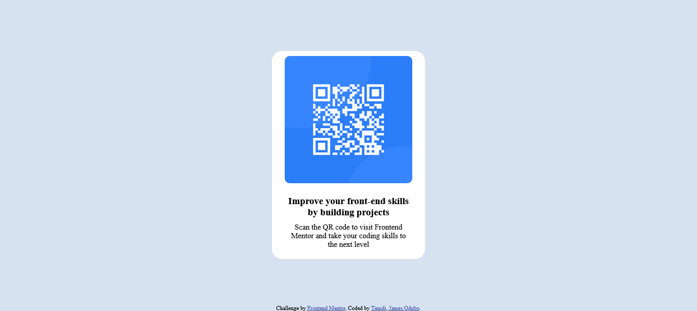

# Frontend Mentor - QR code component solution

## Overview

### Screenshot

### Links

- Solution URL: [https://charming-palmier-6ce61d.netlify.app/](https://charming-palmier-6ce61d.netlify.app/)
- Live Site URL: [https://charming-palmier-6ce61d.netlify.app/](https://charming-palmier-6ce61d.netlify.app/)

## My process

### Built with

- Semantic HTML5 markup
- CSS custom properties
- Flexbox

### What I learned

This page was designed using just HTML and CSS,
created, different div class to make styling with css easir. I also made use of flex property to make the page responsive to different screen size. I also learnt how to import fonts for CSS

To see how you can add code snippets, see below:

### Continued development

I noticed that as the screen size got ver small one of the margin on main div disappeared... I still have to correct that.

## Author

- Website - [Add your name here](https://www.your-site.com)
- Frontend Mentor - [@timidij](https://www.frontendmentor.io/profile/timidij)
- Twitter - [@OduboJames](https://www.twitter.com/OduboJames)

